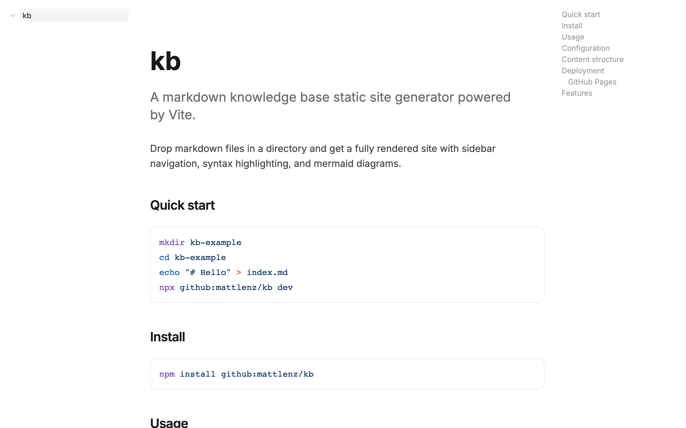
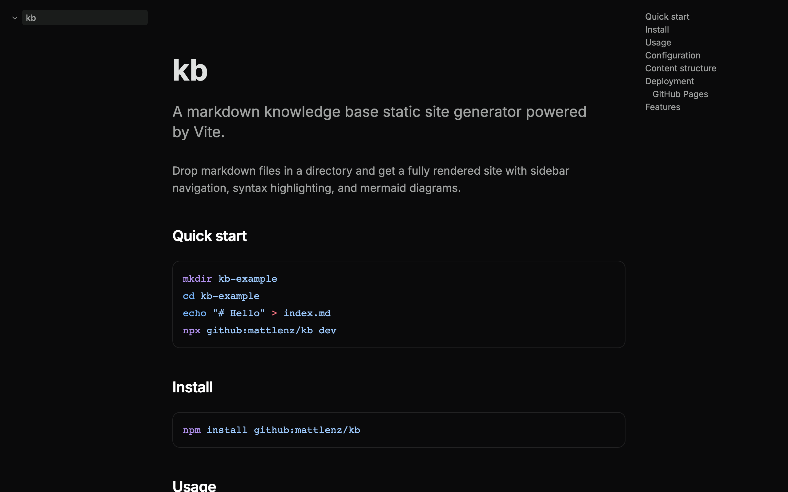

# kb

A markdown knowledge base. Directories are sections, markdown files are pages. No database, no CMS — edit text files, get a site.

| Light | Dark |
|-------|------|
|  |  |

## Quick start

```bash
mkdir my-wiki && cd my-wiki
echo "# Hello" > index.md
kb dev
# → http://localhost:5173
```

## Commands

```bash
kb dev          # Dev server with live reload
kb build        # Static site generation (validates links)
kb create       # Create a new page or section
kb tree         # Print content hierarchy
kb validate     # Check pages and links
```

## Docs

Run `kb dev` in this repo, or read [docs/guide.md](docs/guide.md).
