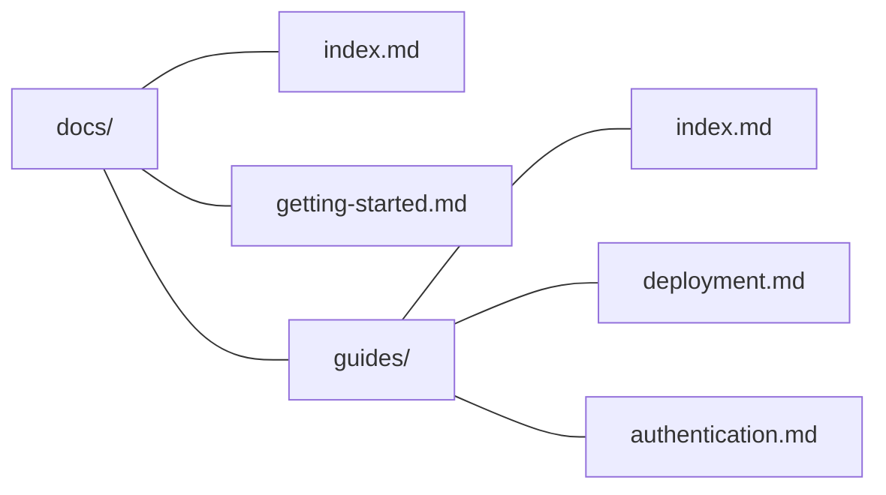

## Getting started

kb works with zero config. Point it at a directory of markdown files:

```bash
kb dev                      # looks for docs/, falls back to .
kb dev --content-dir wiki   # or specify explicitly
```

When you need more control, add a [[configuration|kb.config.ts]].

## Organizing content

Your file structure _is_ your sidebar — directories become collapsible folders, markdown files become pages:



Each file maps to a URL: `getting-started.md` → `/getting-started`, `guides/deployment.md` → `/guides/deployment`.

### Section pages

A directory's `index.md` provides the content for that folder's page. Without one, the folder still appears in the sidebar but has no page body.

### Ordering

By default, folders sort before documents, and pages sort by most-recently modified first.

To set an explicit order, add `children` to a section's `index.md`:

```yaml
---
title: Guides
children:
  - deployment
  - authentication
  - troubleshooting
---
```

Listed pages appear first in order. Any unlisted pages are appended after.

### Assets

Non-markdown files (images, PDFs, etc.) placed in the content directory are served in dev and copied to the build output. Reference them with relative paths:

```markdown

```

## Linking between pages

Three ways to link, all resolve the same way:

| Syntax | Example | Best for |
|--------|---------|----------|
| Wiki link | `[[deployment]]` | Quick cross-references in prose |
| Wiki link with text | `[[deployment\|Deploy guide]]` | Custom display text |
| Relative .md link | `[Deploy guide](./deployment.md)` | IDE click-through |

Wiki links are the fastest to type. Relative `.md` links have the advantage of working in GitHub's markdown preview and in your editor's go-to-definition.

All internal links are validated — `kb build` and `kb validate` will report any broken references.

## Frontmatter

| Field | Type | Where | Description |
|-------|------|-------|-------------|
| `title` | `string` | Any page | Page title. Falls back to the filename. |
| `description` | `string` | Any page | Subtitle shown below the title. |
| `children` | `string[]` | `index.md` only | Sidebar order for child pages. |
