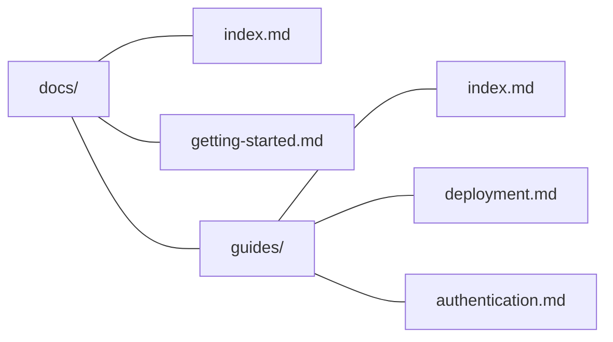

## Getting started

kb works with zero config. Point it at a directory of markdown files:

```bash
kb dev                      # looks for docs/, falls back to .
kb dev --content-dir wiki   # or specify explicitly
```

When you need more control, add a `kb.config.ts` to your repo root:

```typescript
import { defineConfig } from "@mattlenz/kb";

export default defineConfig({
  title: "My Wiki",
  contentDir: "docs",
});
```

## Organizing content

Your file structure _is_ your sidebar — directories become collapsible folders, markdown files become pages:



Each file maps to a URL: `getting-started.md` → `/getting-started`, `guides/deployment.md` → `/guides/deployment`.

### Section pages

A directory's `index.md` provides the content for that folder's page. Without one, the folder still appears in the sidebar but has no page body.

### Ordering

By default, folders sort before documents, and pages sort by most-recently modified first.

To set an explicit order, add `children` to a section's `index.md`:

```yaml
---
title: Guides
children:
  - deployment
  - authentication
  - troubleshooting
---
```

Listed pages appear first in order. Any unlisted pages are appended after.

### Assets

Non-markdown files (images, PDFs, etc.) placed in the content directory are served in dev and copied to the build output. Reference them with relative paths:

```markdown

```

## Linking between pages

Three ways to link, all resolve the same way:

| Syntax | Example | Best for |
|--------|---------|----------|
| Wiki link | `[[deployment]]` | Quick cross-references in prose |
| Wiki link with text | `[[deployment\|Deploy guide]]` | Custom display text |
| Relative .md link | `[Deploy guide](./deployment.md)` | IDE click-through |

Wiki links are the fastest to type. Relative `.md` links have the advantage of working in GitHub's markdown preview and in your editor's go-to-definition.

All internal links are validated — `kb build` and `kb validate` will report any broken references.

## Frontmatter

| Field | Type | Where | Description |
|-------|------|-------|-------------|
| `title` | `string` | Any page | Page title. Falls back to the filename. |
| `description` | `string` | Any page | Subtitle shown below the title. |
| `children` | `string[]` | `index.md` only | Sidebar order for child pages. |

## Deploying

```bash
kb build                    # outputs to dist/
```

Build validates all links automatically. For subpath deployments (e.g. GitHub Pages project sites):

```bash
kb build --base /repo-name
```

### CI

Run validation in CI to catch broken links before deploy:

```bash
kb validate                 # exit code 1 on errors
```

Or rely on `kb build` which validates after generating — a non-zero exit code will fail your CI pipeline.

## Configuration reference

```typescript
import { defineConfig } from "@mattlenz/kb";

export default defineConfig({
  // Site title — sidebar root and <title> tag.
  // Default: "Wiki"
  title: "My Wiki",

  // Content directory, relative to repo root.
  // Default: "docs" if it exists, otherwise "."
  contentDir: "docs",

  // Base path for subpath deployments.
  // Default: ""
  base: "/my-repo",

  // Additional Shiki languages for syntax highlighting.
  // Common languages are included by default.
  languages: ["ruby", "elixir", "hcl"],
});
```

### Default languages

Syntax highlighting is included for: TypeScript, JavaScript, TSX, JSX, JSON, Bash, Shell, YAML, Markdown, CSS, HTML, Python, Go, Rust, Swift, SQL, GraphQL, Diff, and TOML.

Add more via the `languages` config. Any [Shiki language](https://shiki.style/languages) is supported.

## CLI reference

```bash
kb dev                  # Start dev server with live reload
kb build                # Build static site (validates links after)
kb validate             # Check all pages render and links resolve

# Options
kb dev --port 3000      # Custom port
kb build --base /docs   # Subpath deployment
kb dev --content-dir .  # Override content directory
```

## Programmatic API

The core library is available as `@mattlenz/kb`:

```typescript
import { createKb, resolveConfig } from "@mattlenz/kb";

const config = resolveConfig(process.cwd());
const kb = createKb(config);

const tree = kb.getTree();
const node = await kb.getNode("/guides/deployment");
```

The Vite plugin is available as `@mattlenz/kb/vite`:

```typescript
import { kb } from "@mattlenz/kb/vite";

export default {
  plugins: [kb({ title: "My Wiki" })],
};
```
