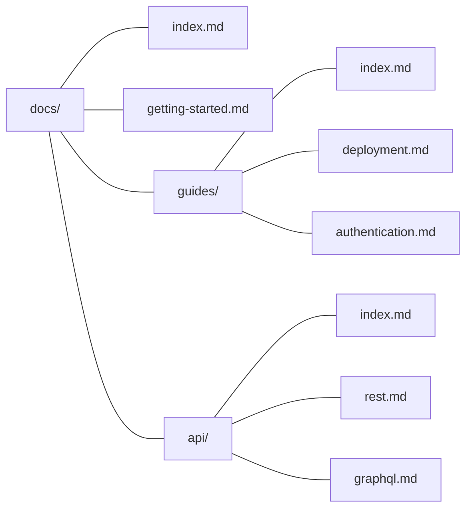

## Content directory

kb looks for a `docs/` directory by default. If none exists, it uses the current directory. Override this in `kb.config.ts`:

```typescript
import { defineConfig } from "@mattlenz/kb";

export default defineConfig({
  contentDir: "knowledge",
});
```

## File structure

Your file structure _is_ your knowledge tree — directories become folders, markdown files become pages, and the sidebar mirrors what's on disk:



**Directories** become collapsible folders in the sidebar. A directory's `index.md` provides the folder's content page — without one, the folder still appears but has no page content.

**Markdown files** (excluding `index.md`) become document pages. The filename becomes the URL slug.

**Non-markdown files** (images, PDFs, etc.) placed in the content directory are served directly in dev mode and copied to the build output. Reference them with relative paths:

```markdown

[Download the spec](./spec.pdf)
```

## Frontmatter

Every markdown file can include YAML frontmatter:

```markdown
---
title: Getting Started
description: Set up your first wiki in under a minute.
---

Page content here...
```

| Field | Type | Where | Description |
|-------|------|-------|-------------|
| `title` | `string` | Any page | Page title for sidebar, breadcrumbs, outline, and `<title>` tag. Falls back to the filename. |
| `description` | `string` | Any page | Subtitle shown below the title in the page header. |
| `children` | `string[]` | `index.md` only | Ordered list of child filenames (without `.md`) to control sidebar order. |

### Custom ordering with `children`

List child filenames in the order you want them to appear:

```markdown
---
title: Guides
children:
  - deployment
  - authentication
  - troubleshooting
---
```

Pages listed in `children` appear first, in the specified order. Any remaining pages not listed are appended after, sorted by the default rules.

## Sort order

When no `children` frontmatter is specified, pages are sorted by:

1. **Kind** — folders appear before documents
2. **Modified time** — newest files first (by filesystem mtime)

This means recently edited pages naturally float to the top.

## URLs

Each file maps directly to a URL:

| File | URL |
|------|-----|
| `index.md` | `/` |
| `overview.md` | `/overview` |
| `guides/index.md` | `/guides` |
| `guides/setup.md` | `/guides/setup` |

The filename minus `.md` becomes the URL path. `index.md` files resolve to their parent directory.

## Configuration

The full `kb.config.ts` options:

```typescript
import { defineConfig } from "@mattlenz/kb";

export default defineConfig({
  // Site title — shown in the sidebar root and <title> tag.
  // Default: "Wiki"
  title: "My Docs",

  // Content directory, relative to the repo root.
  // Default: "docs" if it exists, otherwise "."
  contentDir: "docs",

  // Base path for subpath deployments (e.g. GitHub Pages).
  // Default: ""
  base: "/my-repo",

  // Additional Shiki languages for syntax highlighting.
  // A set of common languages is included by default.
  languages: ["ruby", "elixir", "hcl"],
});
```

### Default languages

Syntax highlighting is included out of the box for: TypeScript, JavaScript, TSX, JSX, JSON, Bash, Shell, YAML, Markdown, CSS, HTML, Python, Go, Rust, Swift, SQL, GraphQL, Diff, and TOML.

Add more via the `languages` config. Any language [supported by Shiki](https://shiki.style/languages) can be added.

## CLI

```bash
kb dev                  # Start dev server with live reload
kb build                # Build static site to dist/
kb validate             # Check all pages render without errors

# Options
kb dev --port 3000      # Custom port
kb build --base /docs   # Subpath deployment
kb dev --content-dir .  # Override content directory
```

## Programmatic API

The core library is available as `@mattlenz/kb`:

```typescript
import { createKb, resolveConfig, renderMarkdown } from "@mattlenz/kb";

const config = resolveConfig(process.cwd());
const kb = createKb(config);

// Get the full tree
const tree = kb.getTree();

// Get a single page with rendered content
const node = await kb.getNode("guides/deployment");
console.log(node?.hast);  // HAST (HTML AST)
console.log(node?.headings);  // Extracted headings
console.log(node?.breadcrumbs);  // Navigation breadcrumbs
```

The Vite plugin is available as `@mattlenz/kb/vite`:

```typescript
import { kb } from "@mattlenz/kb/vite";

// Use in a custom Vite config
export default {
  plugins: [kb({ title: "My KB" })],
};
```
