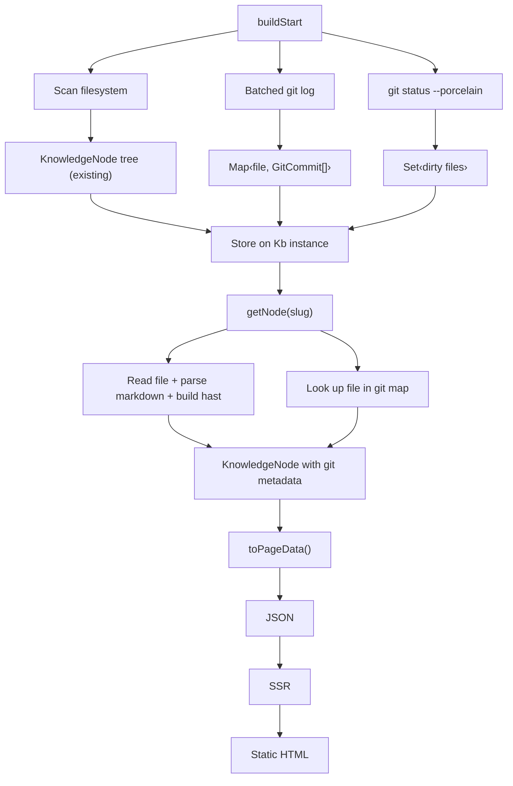
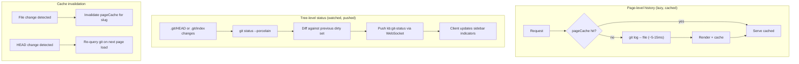

## Data model

Extend `KnowledgeNode` with optional git metadata:

```ts
interface GitCommit {
  hash: string;
  author: string;
  date: string;      // ISO 8601
  message: string;
}

interface KnowledgeNode {
  // ... existing fields
  lastCommit?: GitCommit;
  contributors?: string[];
  dirty?: boolean;          // uncommitted changes to this file
  history?: GitCommit[];    // full commit history for the page
}
```

New tree-level state:

```ts
interface GitTreeState {
  dirtyFiles: Set<string>;      // slugs with uncommitted changes
  branch: string;               // current branch name
  branches: string[];           // all local branches
  recentActivity: ActivityEntry[];
}

interface ActivityEntry {
  commit: GitCommit;
  slugs: string[];              // pages touched by this commit
}
```

## Git commands

### Tree-level (run once, shared)

| Command | Data |
|---------|------|
| `git status --porcelain -- <contentDir>` | dirty file set |
| `git log --name-only --format='%H\|%an\|%aI\|%s' -n 100 -- <contentDir>` | recent activity + per-file history |
| `git branch --list` | branches |
| `git rev-parse --abbrev-ref HEAD` | current branch |

### Per-page (derived from batched log)

One batched `git log --name-only` across the content dir builds a `Map<filePath, GitCommit[]>`. Per-page lookups are map gets, not separate shell calls.

Contributors derived from the commit list: `Array.from(new Set(commits.map(c => c.author)))`.

## Implementation: `src/core/git.ts`

Single module that wraps git CLI calls. Returns structured data. No git library dependency — just `child_process.execSync` / `execFileSync`.

```ts
export function getGitTreeState(contentDir: string): GitTreeState;
export function getFileHistory(contentDir: string, filePath: string, limit?: number): GitCommit[];
export function getFileDiff(filePath: string, ref?: string): string;  // unified diff
export function getBranchContent(branch: string, filePath: string): string | null;  // git show
```

## Data flow

### Build mode



### Dev mode



## UI surfaces

### Passive (decorate existing views)

- **Page header**: "Last edited by {author}, {relative time}" below the title
- **Sidebar indicators**: dot or color on nodes with uncommitted changes
- **Contributors**: avatar-style list (initials?) on each page

### Active (new views)

- **Page history**: list of commits that touched this page — date, author, message, link to diff
- **Activity feed**: recent changes across the whole wiki, accessible via `/__activity` or a sidebar link
- **Diff view**: show what changed in a specific commit, or working tree vs HEAD

### Ambitious (git-native wiki)

- **Branch preview**: toggle the wiki to render content from a different branch via `git show <branch>:<file>`
- **Branch diff**: "these pages are new/changed on branch X vs main"
- **Inline diff**: render working-tree or branch changes as highlighted additions/deletions within the page

## Design tension

Branch content breaks the simple model. Everything above "ambitious" is metadata about the current working tree. Showing content from other branches means either:

- **`git show <branch>:<file>`** — read file from git blob, feed content string to the existing render pipeline (scanner bypass)
- **`git worktree`** — check out another branch in a temp directory, let the existing fs-based scanner read it as-is (heavier, cleaner separation)

Diffs return raw unified diff text. Options:
- Render as a styled `<pre>` block (simple)
- Parse hunks into a side-by-side or inline highlighted view (richer, more work)

## Open questions

- Should git integration be opt-in via config, or always-on when a `.git` dir exists?
- How far to go with branch awareness in v1? Per-page history + activity feed might be the 80/20.
- Performance budget for git calls during build — acceptable to add ~1s to a 100-page wiki?
- Should activity/history be available in static builds, or dev-only? (Static = snapshot at build time, which is still useful.)
