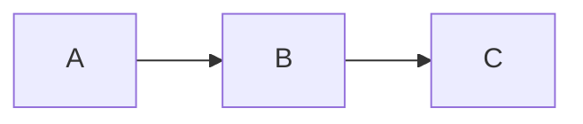

A knowledge base is a tree of markdown files. Your filesystem is the structure — directories are sections, markdown files are pages. There's no database, no CMS, no admin UI. You edit text files.

## The tree

Every knowledge base has a root directory (usually `docs/`) containing markdown files and subdirectories:

```
docs/
  index.md              ← root page
  getting-started.md
  guides/
    index.md            ← section page for "guides"
    deployment.md
    authentication.md
  reference/
    index.md
    api.md
```

Each file maps to a URL path: `guides/deployment.md` → `/guides/deployment`. A directory's `index.md` provides the section page — without one, the section still appears in the sidebar but has no content.

Run `kb tree` to see the full hierarchy with titles and dates:

```bash
kb tree
```

### Ordering

By default, directories sort before files, and files sort by most-recently modified first.

To set an explicit order, add `children` to a section's `index.md` frontmatter:

```yaml
---
title: Guides
children:
  - deployment
  - authentication
---
```

Listed pages appear first, in order. Unlisted pages are appended after, sorted by mtime.

## Pages

Every page is a markdown file with optional YAML frontmatter:

```markdown
---
title: Deployment Guide
description: How to deploy to production.
created_at: 2026-04-01
updated_at: 2026-04-09
---

Your content here.
```

| Field | Purpose |
|-------|---------|
| `title` | Page title. Falls back to the filename if omitted. |
| `description` | Subtitle shown below the title. |
| `created_at` | When the page was created. |
| `updated_at` | When the page was last meaningfully changed. |
| `children` | Display order for child pages (index.md only). |

Only `title` matters for rendering. The rest is metadata for humans and agents.

## Links

Three syntaxes, all validated on build:

| Syntax | Example |
|--------|---------|
| Wiki link | `[[deployment]]` |
| Wiki link with text | `[[deployment\|Deploy guide]]` |
| Relative path | `[Deploy guide](./deployment.md)` |

Wiki links are fast to type. Relative `.md` links work in GitHub's preview and your editor's go-to-definition.

Link to pages in other sections with relative paths: `[Architecture](../projects/architecture.md)`.

## Formatting

Standard GitHub Flavored Markdown: **bold**, *italic*, ~~strikethrough~~, tables, task lists, footnotes.

Code blocks with syntax highlighting:

````markdown
```typescript
const x = 1;
```
````

Diagrams with Mermaid and PlantUML:

````markdown

````

Images and assets placed in the content directory are served directly:

```markdown

```

See [[formatting]] for a full reference of supported features.

## Assets

Non-markdown files (images, PDFs, fonts) placed anywhere in the content directory are served in dev and copied to the build output. Reference them with relative paths from the page.

## History

A knowledge base in a git repo has full history built in. Use it to understand how content evolved, spot staleness, and find context behind decisions.

```bash
git log --oneline docs/                              # recent changes across the whole kb
git log --oneline docs/projects/background-agents/   # recent changes in a section
git log -p docs/projects/environments/web-env-config.md  # full history of a page
git blame docs/projects/background-agents/architecture.md  # who wrote what
```

History is especially useful for detecting stale content — if a page's `updated_at` says April but git shows no commits since March, the metadata is lying. Cross-reference `kb tree` dates against `git log` to find pages that need attention.

## Tools

```bash
kb dev                  # Start dev server with live reload
kb build                # Build static site (validates links after)
kb create <path>        # Create a new page (trailing / for section)
kb tree                 # Print content hierarchy with titles and dates
kb validate             # Check all pages render and links resolve
```

`kb validate` and `kb build` both catch broken internal links — a broken link produces a non-zero exit code. Run validate in CI or after making changes to catch problems early.

## Getting started

```bash
mkdir docs
echo "# Hello" > docs/index.md
kb dev
# → http://localhost:5173
```

No config needed. Add a [[configuration|kb.config.ts]] when you want to customize the title, base path, or syntax highlighting languages.
