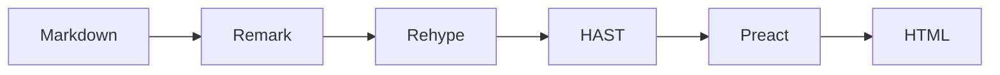
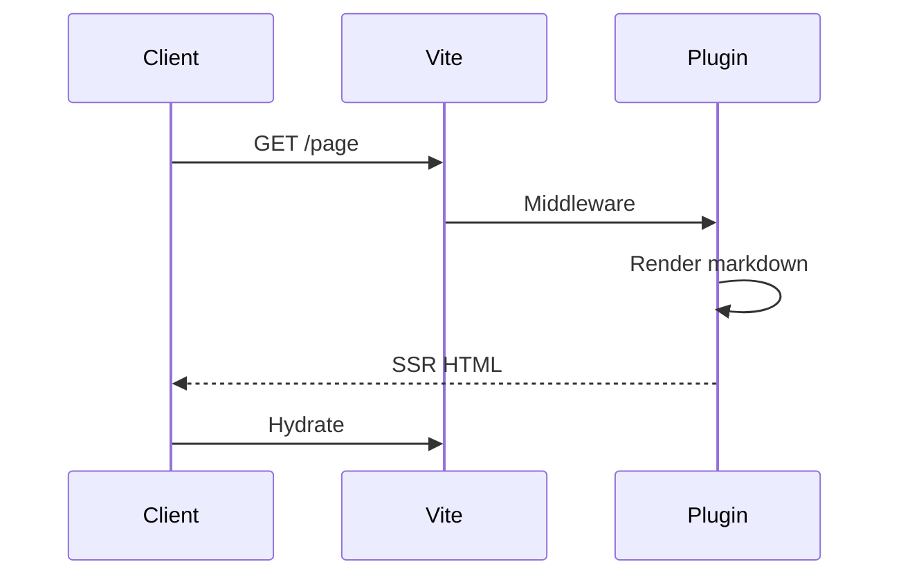

This page demonstrates all supported markdown rendering features. Use it as a reference and a visual regression test.

## Text styling

**Bold text** and __also bold__. *Italic text* and _also italic_. ~~Strikethrough text~~.

**This text is _extremely_ important.** ***All this text is important.***

This is a <sub>subscript</sub> and this is a <sup>superscript</sup>.

## Headings

Headings from `##` through `####` appear in the page outline on the right:

### Third-level heading

Content under a third-level heading.

#### Fourth-level heading

Content under a fourth-level heading.

## Links

[Inline link](https://github.com) and [link with title](https://github.com "GitHub").

Autolinked URL: https://github.com

[Relative link to the root page](/)

[Relative link to concepts (URL)](./concepts)

[Relative link to concepts (.md)](./concepts.md)

[Relative link to fonts (.md)](./fonts.md)

## Blockquotes

> This is a blockquote. It can span multiple lines.
>
> It can contain **bold**, *italic*, and `code`.

Nested blockquotes:

> Outer quote
>
> > Nested quote

## Lists

### Unordered

- First item
- Second item
  - Nested item
  - Another nested item
    - Deeply nested
- Third item

### Ordered

1. First item
2. Second item
   1. Nested ordered
   2. Another nested
3. Third item

### Task list

- [x] Completed task
- [ ] Incomplete task
- [ ] Another incomplete task

### Mixed

1. First ordered item
   - Unordered sub-item
   - Another sub-item
2. Second ordered item

## Code

Inline `code` looks like this. A longer inline example: `const x = Math.random()`.

### Fenced code blocks

```typescript
interface User {
  id: string;
  name: string;
  email: string;
}

function greet(user: User): string {
  return `Hello, ${user.name}!`;
}
```

```python
def fibonacci(n: int) -> list[int]:
    """Generate the first n Fibonacci numbers."""
    seq = [0, 1]
    for _ in range(2, n):
        seq.append(seq[-1] + seq[-2])
    return seq[:n]
```

```bash
#!/bin/bash
echo "Hello from bash"
for i in {1..5}; do
  echo "Count: $i"
done
```

```json
{
  "name": "@mattlenz/kb",
  "version": "0.0.1",
  "type": "module"
}
```

```css
.kb-layout {
  display: flex;
  min-height: 100vh;
  font-family: "Monument Grotesk", system-ui, sans-serif;
}
```

```sql
SELECT users.name, COUNT(posts.id) AS post_count
FROM users
LEFT JOIN posts ON posts.author_id = users.id
GROUP BY users.id
HAVING post_count > 10
ORDER BY post_count DESC;
```

A plain code block with no language:

```
No syntax highlighting here.
Just plain monospace text.
```

## Tables

| Feature | Status | Notes |
|---------|--------|-------|
| Bold | Supported | `**text**` |
| Italic | Supported | `*text*` |
| Strikethrough | Supported | `~~text~~` |
| Tables | Supported | GFM extension |
| Task lists | Supported | GFM extension |

### Alignment

| Left-aligned | Center-aligned | Right-aligned |
|:-------------|:--------------:|--------------:|
| Left | Center | Right |
| Content | Content | Content |
| More | More | More |

## Images

Images from the content directory are served directly:


## Horizontal rules

Content above.

---

Content below.

## Footnotes

Here is a statement with a footnote[^1]. And another[^2].

[^1]: This is the first footnote.
[^2]: This is the second footnote with `inline code`.

## Mermaid diagrams





## Escaping

Literal asterisks: \*not italic\*. Literal backticks: \`not code\`.

## Long content

This section tests how the layout handles longer prose. The sidebar should remain sticky, the outline should track scroll position, and the main content area should scroll independently.

Lorem ipsum dolor sit amet, consectetur adipiscing elit. Sed do eiusmod tempor incididunt ut labore et dolore magna aliqua. Ut enim ad minim veniam, quis nostrud exercitation ullamco laboris nisi ut aliquip ex ea commodo consequat. Duis aute irure dolor in reprehenderit in voluptate velit esse cillum dolore eu fugiat nulla pariatur. Excepteur sint occaecat cupidatat non proident, sunt in culpa qui officia deserunt mollit anim id est laborum.
